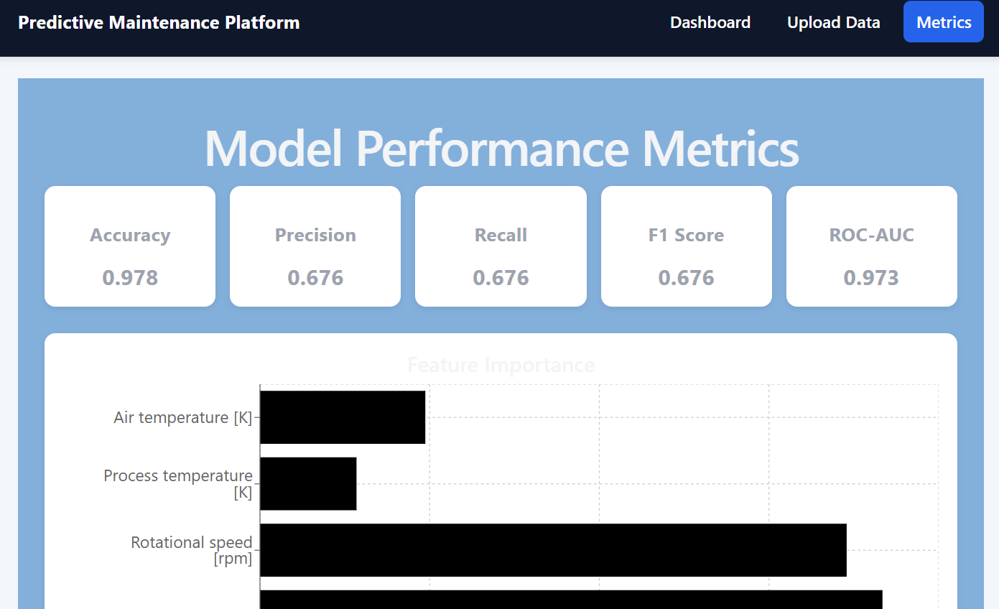

<div align="center">

#  Predictive Maintenance System

### An industrial IoT application that uses machine learning to predict equipment failures before they happen

<br/>

<!-- Backend -->


<!-- Frontend -->


</div>

---

##  Screenshots

| Dashboard | Machine Alerts |
|:---------:|:--------------:|
|  |  |

| Sensor Chart & Table | Upload Data | Model Metrics |
|:--------------------:|:-----------:|:-------------:|
|  |  |  |

| Confusion Matrix |
|:----------------:|
|  |

---

##  Overview

Unplanned machine downtime is one of the costliest problems in industrial operations. This system uses a trained **Random Forest classifier** on the [AI4I 2020 Predictive Maintenance Dataset](https://archive.ics.uci.edu/ml/datasets/AI4I+2020+Predictive+Maintenance+Dataset) to analyze real-time sensor readings and predict the probability of machine failure before it happens.

The backend exposes a **FastAPI** REST API for both single and batch predictions. The frontend is a **React + Vite** dashboard with live health status cards, sensor charts, alert panels, and a CSV batch upload tool.

---

##  Features

-  **Real-time Failure Prediction** — Submit live sensor readings and get instant failure probability, risk score, and health status
-  **Batch CSV Upload** — Upload a CSV file of sensor readings and get predictions for every row at once
-  **Health Status Classification** — Each machine is labelled `Healthy`, `Warning`, or `Critical` based on risk score thresholds
-  **Actionable Recommendations** — Rule-based engine surfaces specific maintenance guidance (e.g. *"Inspect cooling system and consider tool replacement"*)
-  **Interactive Sensor Charts** — Recharts-powered visualizations of torque, temperature, tool wear, and rotational speed across machines
-  **Model Metrics Dashboard** — Accuracy, Precision, Recall, F1 Score, ROC-AUC, feature importances, and confusion matrix — all served live from the model bundle
-  **Responsive UI** — Clean React dashboard with gradient layout, card-based health indicators, and alert panels

---

##  Tech Stack

### Backend

| Technology | Badge | Purpose |
|---|---|---|
| Python 3.10+ |  | Core language |
| FastAPI |  | REST API framework |
| Uvicorn |  | ASGI server |
| scikit-learn |  | Random Forest classifier |
| Pandas |  | Data processing & CSV parsing |
| NumPy |  | Numerical operations |
| joblib |  | Model serialization (`.pkl`) |
| Matplotlib |  | Confusion matrix plot generation |
| Pydantic |  | Request schema validation |
| python-multipart |  | CSV file upload handling |

### Frontend

| Technology | Badge | Purpose |
|---|---|---|
| React 19 |  | UI framework |
| Vite 8 |  | Build tool & dev server |
| React Router DOM v7 |  | Client-side routing |
| Recharts |  | Sensor data bar/line charts |
| Axios |  | HTTP client for API calls |

---

##  Project Structure

```
predictive-maintenance-system/
│
├── backend/
│   ├── app/
│   │   ├── main.py              # FastAPI app & all route definitions
│   │   ├── schemas.py           # Pydantic input schema (SensorDataInput)
│   │   ├── ml/
│   │   │   ├── predictor.py     # Inference, risk scoring & recommendation engine
│   │   │   └── model.pkl        # Pre-trained RF bundle (model + metrics + features)
│   │   └── static/
│   │       └── confusion_matrix.png
│   ├── train_model.py           # Training, evaluation & artifact generation script
│   └── requirements.txt
│
├── frontend/
│   ├── index.html
│   ├── vite.config.js
│   ├── package.json
│   └── src/
│       ├── App.jsx
│       ├── main.jsx
│       ├── pages/
│       │   ├── Dashboard.jsx    # Main health monitoring view
│       │   ├── UploadData.jsx   # Batch CSV prediction page
│       │   └── Metrics.jsx      # Model performance & feature importance
│       ├── components/
│       │   ├── Layout.jsx       # App shell & navigation bar
│       │   ├── HealthCard.jsx   # Summary stat cards
│       │   ├── AlertCard.jsx    # Warning & Critical alert items
│       │   ├── MachineTable.jsx # Full predictions table
│       │   └── SensorChart.jsx  # Recharts sensor visualization
│       └── services/
│           └── api.js           # Axios base URL configuration
│
├── data/
│   └── ai4i2020.csv             # UCI training dataset (10,000 rows)
│
└── screenshots/
```

---

##  Machine Learning Model

| Detail | Value |
|---|---|
| **Algorithm** | Random Forest Classifier |
| **Estimators** | 200 trees |
| **Max Depth** | 10 |
| **Class Weights** | Balanced (handles ~3.4% positive rate) |
| **Train / Test Split** | 80% / 20% (stratified) |
| **Features** | Air temp, Process temp, Rotational speed, Torque, Tool wear |
| **Target** | Binary `Machine failure` label |

### Risk Score Thresholds

| Risk Score | Status | Action |
|---|---|---|
| ≤ 30 | ✅ **Healthy** | Continue monitoring |
| 31 – 70 | ⚠️ **Warning** | Schedule inspection |
| > 70 | 🔴 **Critical** | Immediate action required |

### Rule-Based Recommendation Engine

| Sensor Condition | Recommendation |
|---|---|
| Process temp > 310 K **and** Tool wear > 200 min | Inspect cooling system and consider tool replacement |
| Torque > 50 Nm **and** Rotational speed < 1400 rpm | Check motor load and shaft alignment |
| Air temp > 305 K **and** Torque > 55 Nm | Inspect overheating and vibration-related components |
| Default | No immediate action required. Continue monitoring |

---

##  Getting Started

### Prerequisites


---

### 1. Clone the Repository

```bash
git clone https://github.com/Dhanush-1213/predictive-maintenance-system.git
cd predictive-maintenance-system
```

---

### 2. Backend Setup

```bash
cd backend

# Create and activate virtual environment (recommended)
python -m venv venv
source venv/bin/activate          # Windows: venv\Scripts\activate

# Install dependencies
pip install -r requirements.txt

# (Optional) Retrain the model — a pre-trained model.pkl is already included
python train_model.py

# Start the API server
uvicorn app.main:app --reload
```

> **API** → `http://127.0.0.1:8000`  
> **Swagger Docs** → `http://127.0.0.1:8000/docs`

---

### 3. Frontend Setup

Open a **new terminal**:

```bash
cd frontend
npm install
npm run dev
```

> **App** → `http://localhost:5173`

>  Make sure the backend server is running before launching the frontend.

---

## 📖 Usage

### Dashboard

Click **"Run Sample Predictions"** to run the model against 4 built-in machines with varied sensor profiles:

- View health summary cards (Total / Healthy / Warning / Critical)
- Inspect per-sensor readings in an interactive bar chart
- Review real-time alerts for Warning and Critical machines
- Browse the full prediction table with risk scores and recommendations

### Upload Data (Batch Prediction)

Navigate to **Upload Data** to submit a CSV with multiple sensor readings at once.

**Required CSV columns:**

| Column Name | Alternate (auto-renamed) | Description |
|---|---|---|
| `Air temperature [K]` | `Air_temperature_K` | Ambient temperature in Kelvin |
| `Process temperature [K]` | `Process_temperature_K` | Process temperature in Kelvin |
| `Rotational speed [rpm]` | `Rotational_speed_rpm` | Spindle speed |
| `Torque [Nm]` | `Torque_Nm` | Applied torque |
| `Tool wear [min]` | `Tool_wear_min` | Cumulative tool wear in minutes |

> The API accepts both bracket-style and underscore-style column names — export directly from any SCADA or historian system.

### Model Metrics

Navigate to **Metrics** to view live model performance fetched from the model bundle: Accuracy, Precision, Recall, F1 Score, ROC-AUC, feature importance rankings, and the confusion matrix.

---

##  API Reference

### `GET /`
Health check. Returns `{ "message": "Predictive Maintenance API is running" }`.

---

### `GET /metrics`
Returns model evaluation metrics and feature importances directly from the saved model bundle.

---

### `POST /predict`
Single machine prediction.

**Request:**
```json
{
  "Air_temperature_K": 300.0,
  "Process_temperature_K": 310.5,
  "Rotational_speed_rpm": 1500,
  "Torque_Nm": 45.0,
  "Tool_wear_min": 120
}
```

**Response:**
```json
{
  "failure_prediction": 0,
  "failure_probability": 0.0821,
  "risk_score": 8.21,
  "health_status": "Healthy",
  "recommendation": "No immediate action required. Continue monitoring."
}
```

---

### `POST /predict-batch`
Batch prediction from a CSV file upload.

**Request:** `multipart/form-data` with a `.csv` file in a field named `file`

**Response:**
```json
{
  "total_rows": 100,
  "predictions": [
    {
      "row_id": 0,
      "failure_prediction": 1,
      "failure_probability": 0.8342,
      "risk_score": 83.42,
      "health_status": "Critical",
      "recommendation": "Inspect cooling system and consider tool replacement."
    }
  ]
}
```

---

##  Dataset

**AI4I 2020 Predictive Maintenance Dataset** — UCI Machine Learning Repository

- **10,000** data points simulating industrial milling machine sensor behavior
- **5 features** used for training after dropping metadata and sub-failure-type columns
- **~3.4%** positive (failure) rate — handled via `class_weight="balanced"`

> Matzka, S. (2020). *Explainable Artificial Intelligence for Predictive Maintenance Applications.* IEEE AIKE.

---

##  Future Improvements

- [ ] WebSocket support for live streaming sensor data
- [ ] Time-series anomaly detection model (LSTM / Isolation Forest)
- [ ] Docker + Docker Compose for one-command deployment
- [ ] Authentication & multi-user support
- [ ] Historical prediction logging with a database backend
- [ ] Email / Slack alert notifications for Critical machines
- [ ] Export batch prediction results as CSV

---

##  Author

**Dhanush K**  
PES University | CSE (AIML)  
LinkedIn: [@Dhanush K](https://www.linkedin.com/in/dhanush-k-pes1312/)


---

<div align="center">

⭐ If you found this project helpful, give it a star!

Built with ⚙️ FastAPI · ⚛️ React · 🌲 scikit-learn

</div>
